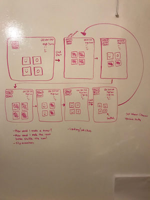

# Project Overview

## Project Schedule

This schedule will be used to keep track of your progress throughout the week and align with our expectations.

You are **responsible** for scheduling time with your squad to seek approval for each deliverable by the end of the corresponding day, excluding `Saturday` and `Sunday`.

| Day              | Deliverable                                   |
| ---------------- | --------------------------------------------- |
| Day 1: Tuesday   | Game Idea                                     |
| Day 2: Wednesday | Completed wireframes and prioritized features |
| Day 3: Thursday  | Pseudocode for entire game                    |
| Day 4: Friday    | Basic Clickable Model of a 4 x 4 version      |
| Day 5: Saturday  | Working Prototype                             |
| Day 6: Sunday    | Game Completed / Slides                       |
| Day 7: Monday    | Project Presentations                         |

## Project Description

This is a time-based memory game. There will be a 10 x 10 grid of icons holding 50 photos and their duplicates. First, the user will input their initials, then it will take them to a display of all of the icon backs. Pressing 'start' will flip the cards face up for 5 seconds, then flip back. Timer begins. Each of these icons will also have a property that shares a single image for when the cards are 'flipped' face-side down. Once clicked, the faces reveal themselves. If the two images match, then the faces stay up. If they do not match, then the back image is displayed for both cards again. Once all images have been matched, the timer stops and is appended to the user's initials in a High Score list. From here, the user has an option to reset the game and re-enter initials. From here, the icons are shuffled and the game resumes as normal.

## Priority Matrix

1. Icons that can be toggled to show faces
   a. when they match, they stay face up.
   Most important feature. Could take 2 - 5 hours.

2. A reset button that takes the user to the landing page to enter their initials.
   a. Every time this happens, the icons are shuffled.
   This will be responsible to reshuffling the board to make every game unique. Possible time: 3-6 hours.

3. A landing page with user's initials with a start button that takes you to the game board.
   Required for project. Will take 2-4 hours to build.

4. Win state page. An alert that will alert the user they have found all matches and their time.
   Necessary for project. Will take 1-2 hours.

5. A Timer that stops once all icons are matched
   Not necessary, but wanted. Will probably take 2-4 hours.

6. High Score board
   Not necessary, but wanted. Will probably take 1-2 hours.

## MVP

1, 2, 3, 4

## POST MVP

5, 6

## Wireframes

## Game Components

### Landing Page

There will be a page with a text box for the user to input their initials. The page will also display "FLCL Memory Game". There will be a button that moves the user to the game board.

### Game Initialization

The game board will display a start button, a 10 x 10 grid of the same icon, a timer, and a score board.

### Playing The Game

Once the start button is clicked, all icons will display face up for 5 seconds, then return back to the universal back image. From here, the timer will start. The user can click on an icon, and it will reveal its face image. The user will click another icon and reveal its face image. If they are a match, the icons stay face up. If they are not a match, the icons revert to the back image. Once all icons have been matched, the timer stops and an alert pops up with "Congratulations, [user initials]! Your time is [number displayed on timer]". Clicking 'okay' on the alert will reveal the matched icons with the user's initials appended with their time potentially added to the score board. From here, the user can click the reset button and head back to the landing page.

### Winning The Game

Once all icons have been matched, the user has one.

### Game Reset

The game sort of freezes after a win state, but the user will have access to a reset button.

## Functional Components

1. function inputInitials () - add user initials to timer and scoreboard
2. function clickReady () - changes user to start of game board
3. function clickStart () - start button flips cards for face up for 5 seconds and starts timer after 5 seconds
4. function flipCards () - waits for two event listeners to toggle for both cards to flip. If not a match, flip back.
5. function resetAndShuffle () - takes user back to landing page and shuffles the array of icons.

Based on the initial logic defined in the previous game phases section try and breakdown the logic further into functional components, and by that we mean functions. Does your logic indicate that code could be encapsulated for the purpose of reusability. Once a function has been defined it can then be incorporated into a class as a method.

Time frames are also key in the development cycle. You have limited time to code all phases of the game. Your estimates can then be used to evaluate game possibilities based on time needed and the actual time you have before game must be submitted.

1.

| Component   | Priority | Estimated Time | Time Invested | Actual Time |
| ----------- | :------: | :------------: | :-----------: | :---------: |
| Component 1 |    H     |     03hrs      |     00hrs     |    00hrs    |

2.

| Component   | Priority | Estimated Time | Time Invested | Actual Time |
| ----------- | :------: | :------------: | :-----------: | :---------: |
| Component 2 |    H     |     03hrs      |     00hrs     |    00hrs    |

3.

| Component   | Priority | Estimated Time | Time Invested | Actual Time |
| ----------- | :------: | :------------: | :-----------: | :---------: |
| Component 3 |    H     |     03hrs      |     00hrs     |    00hrs    |

4.

| Component   | Priority | Estimated Time | Time Invested | Actual Time |
| ----------- | :------: | :------------: | :-----------: | :---------: |
| Component 4 |    H     |     03hrs      |     00hrs     |    00hrs    |

5.

| Component   | Priority | Estimated Time | Time Invested | Actual Time |
| ----------- | :------: | :------------: | :-----------: | :---------: |
| Component 5 |    H     |     03hrs      |     00hrs     |    00hrs    |

## Helper Functions

Helper functions should be generic enough that they can be reused in other applications. Use this section to document all helper functions that fall into this category.

| Function   |                    Description                    |
| ---------- | :-----------------------------------------------: |
| Capitalize | This will capitalize the first letter in a string |

## Additional Libraries

shuffle - will shuffle my array of icons

## jQuery Discoveries

Use this section to list some, but not all, of the jQuery methods and\or functionality discovered while working on this project.

## Change Log

Use this section to document what changes were made and the reasoning behind those changes.

## Issues and Resolutions

Use this section to list of all major issues encountered and their resolution.

#### SAMPLE.....

**ERROR**: app.js:34 Uncaught SyntaxError: Unexpected identifier  
**RESOLUTION**: Missing comma after first object in sources {} object
